# Universal Agent Memory (UAM) - Complete Feature Analysis

> Comprehensive analysis of UAM functionality, architecture, and implications on AI agent performance. UAM provides persistent memory, multi-agent coordination, intelligent worktree management, and automated context generation for AI coding assistants.

## Table of Contents

1. [Executive Summary](#executive-summary)
2. [System Architecture](#system-architecture)
3. [CLI Command Reference](#cli-command-reference)
4. [Memory System](#memory-system)
5. [Multi-Agent Coordination](#multi-agent-coordination)
6. [Task Management System](#task-management-system)
7. [Worktree Workflow](#worktree-workflow)
8. [CLAUDE.md Generation](#claudemd-generation)
9. [Deploy Batching](#deploy-batching)
10. [Agent Performance Implications](#agent-performance-implications)
11. [Integration Patterns](#integration-patterns)

---

## Executive Summary

UAM (Universal Agent Memory) is a comprehensive system designed to enhance AI agent capabilities through:

| Capability | Impact on Agent Performance |
|------------|----------------------------|
| **4-Layer Memory** | 10x context retention, reduces repetition |
| **Multi-Agent Coordination** | Eliminates merge conflicts, enables parallelism |
| **Task Management** | Structured work tracking, dependency awareness |
| **Worktree Isolation** | Safe experimentation, atomic PRs |
| **Deploy Batching** | 50-80% CI/CD cost reduction |
| **CLAUDE.md Generation** | Project-aware context, reduced hallucination |

---

## System Architecture

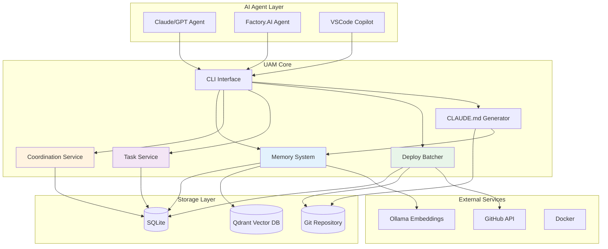
```mermaid
graph TB
    subgraph "AI Agent Layer"
        CLAUDE[Claude/GPT Agent]
        FACTORY[Factory.AI Agent]
        VSCODE[VSCode Copilot]
    end

    subgraph "UAM Core"
        CLI[CLI Interface]
        MEM[Memory System]
        COORD[Coordination Service]
        TASK[Task Service]
        DEPLOY[Deploy Batcher]
        GEN[CLAUDE.md Generator]
    end

    subgraph "Storage Layer"
        SQLITE[(SQLite)]
        QDRANT[(Qdrant Vector DB)]
        GIT[(Git Repository)]
    end

    subgraph "External Services"
        OLLAMA[Ollama Embeddings]
        GITHUB[GitHub API]
        DOCKER[Docker]
    end

    CLAUDE --> CLI
    FACTORY --> CLI
    VSCODE --> CLI

    CLI --> MEM
    CLI --> COORD
    CLI --> TASK
    CLI --> DEPLOY
    CLI --> GEN

    MEM --> SQLITE
    MEM --> QDRANT
    MEM --> OLLAMA

    COORD --> SQLITE
    TASK --> SQLITE
    DEPLOY --> SQLITE
    DEPLOY --> GIT
    DEPLOY --> GITHUB

    GEN --> GIT
    GEN --> MEM

    style MEM fill:#e3f2fd
    style COORD fill:#fff3e0
    style TASK fill:#f3e5f5
    style DEPLOY fill:#e8f5e9
```

### Component Overview

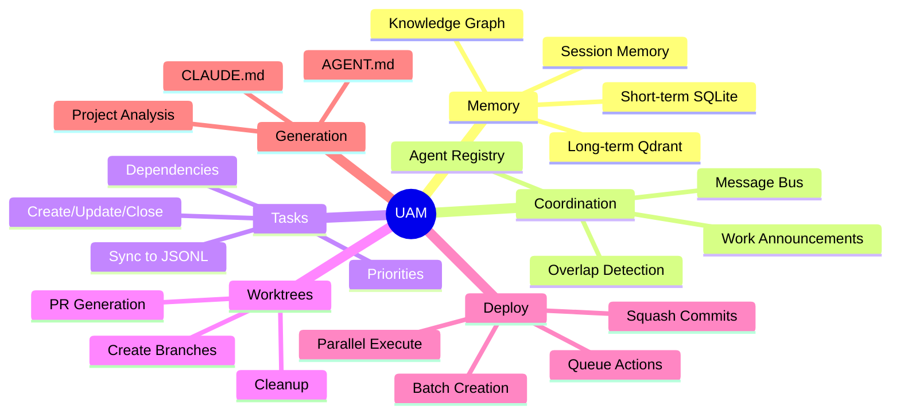
```mermaid
mindmap
  root((UAM))
    Memory
      Short-term SQLite
      Long-term Qdrant
      Session Memory
      Knowledge Graph
    Coordination
      Agent Registry
      Work Announcements
      Message Bus
      Overlap Detection
    Tasks
      Create/Update/Close
      Dependencies
      Priorities
      Sync to JSONL
    Worktrees
      Create Branches
      PR Generation
      Cleanup
    Deploy
      Queue Actions
      Batch Creation
      Squash Commits
      Parallel Execute
    Generation
      CLAUDE.md
      AGENT.md
      Project Analysis
```

---

## CLI Command Reference

### Command Hierarchy


```mermaid
flowchart TB
    UAM[uam]
    
    UAM --> INIT[init]
    UAM --> ANALYZE[analyze]
    UAM --> GENERATE[generate]
    UAM --> UPDATE[update]
    
    UAM --> MEMORY[memory]
    MEMORY --> M_STATUS[status]
    MEMORY --> M_START[start]
    MEMORY --> M_STOP[stop]
    MEMORY --> M_QUERY[query]
    MEMORY --> M_STORE[store]
    MEMORY --> M_PREPOP[prepopulate]
    
    UAM --> WORKTREE[worktree]
    WORKTREE --> W_CREATE[create]
    WORKTREE --> W_LIST[list]
    WORKTREE --> W_PR[pr]
    WORKTREE --> W_CLEANUP[cleanup]
    
    UAM --> AGENT[agent]
    AGENT --> A_REG[register]
    AGENT --> A_HB[heartbeat]
    AGENT --> A_STATUS[status]
    AGENT --> A_ANN[announce]
    AGENT --> A_COMP[complete]
    AGENT --> A_OVER[overlaps]
    AGENT --> A_BROAD[broadcast]
    AGENT --> A_SEND[send]
    AGENT --> A_RECV[receive]
    AGENT --> A_DEREG[deregister]
    
    UAM --> COORD[coord]
    COORD --> C_STATUS[status]
    COORD --> C_FLUSH[flush]
    COORD --> C_CLEAN[cleanup]
    
    UAM --> DEPLOY[deploy]
    DEPLOY --> D_QUEUE[queue]
    DEPLOY --> D_BATCH[batch]
    DEPLOY --> D_EXEC[execute]
    DEPLOY --> D_STATUS[status]
    DEPLOY --> D_FLUSH[flush]
    
    UAM --> TASK[task]
    TASK --> T_CREATE[create]
    TASK --> T_LIST[list]
    TASK --> T_SHOW[show]
    TASK --> T_UPDATE[update]
    TASK --> T_CLOSE[close]
    TASK --> T_DEP[dep/undep]
    TASK --> T_CLAIM[claim]
    TASK --> T_RELEASE[release]
    TASK --> T_STATS[stats]
    TASK --> T_SYNC[sync]

    style MEMORY fill:#e3f2fd
    style AGENT fill:#fff3e0
    style DEPLOY fill:#e8f5e9
    style TASK fill:#f3e5f5
```

### Command Summary Table

| Command | Subcommand | Purpose |
|---------|------------|---------|
| `uam init` | - | Initialize project with CLAUDE.md, memory, worktrees |
| `uam analyze` | - | Analyze project structure, generate metadata |
| `uam generate` | - | Generate/regenerate CLAUDE.md |
| `uam update` | - | Update all UAM components |
| `uam memory` | `status` | Show memory system status |
| | `start/stop` | Control Qdrant container |
| | `query <term>` | Search memories |
| | `store <content>` | Store new memory |
| | `prepopulate` | Import from docs/git history |
| `uam worktree` | `create <slug>` | Create isolated worktree |
| | `list` | List all worktrees |
| | `pr <id>` | Create PR from worktree |
| | `cleanup <id>` | Remove worktree and branch |
| `uam agent` | `register` | Register new agent |
| | `announce` | Announce work intent |
| | `overlaps` | Check for conflicts |
| | `broadcast/send` | Inter-agent messaging |
| `uam coord` | `status` | Show coordination status |
| | `cleanup` | Remove stale data |
| `uam deploy` | `queue` | Queue deploy action |
| | `batch` | Create batch from pending |
| | `execute` | Execute batch |
| | `flush` | Execute all pending |
| `uam task` | `create` | Create task |
| | `list/show` | View tasks |
| | `claim/release` | Work lifecycle |
| | `dep/undep` | Manage dependencies |

---

## Memory System

### Four-Layer Architecture

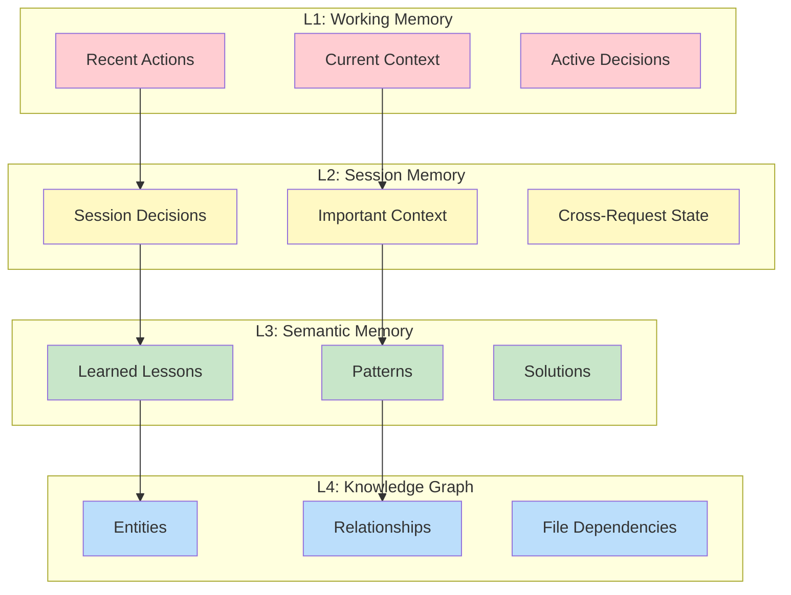
```mermaid
graph TB
    subgraph "L1: Working Memory"
        direction LR
        W1[Recent Actions]
        W2[Current Context]
        W3[Active Decisions]
    end

    subgraph "L2: Session Memory"
        direction LR
        S1[Session Decisions]
        S2[Important Context]
        S3[Cross-Request State]
    end

    subgraph "L3: Semantic Memory"
        direction LR
        SE1[Learned Lessons]
        SE2[Patterns]
        SE3[Solutions]
    end

    subgraph "L4: Knowledge Graph"
        direction LR
        K1[Entities]
        K2[Relationships]
        K3[File Dependencies]
    end

    W1 --> S1
    W2 --> S2
    S1 --> SE1
    S2 --> SE2
    SE1 --> K1
    SE2 --> K2

    style W1 fill:#ffcdd2
    style W2 fill:#ffcdd2
    style W3 fill:#ffcdd2
    style S1 fill:#fff9c4
    style S2 fill:#fff9c4
    style S3 fill:#fff9c4
    style SE1 fill:#c8e6c9
    style SE2 fill:#c8e6c9
    style SE3 fill:#c8e6c9
    style K1 fill:#bbdefb
    style K2 fill:#bbdefb
    style K3 fill:#bbdefb
```

### Memory Layer Characteristics

| Layer | Storage | Capacity | Latency | Retention |
|-------|---------|----------|---------|-----------|
| **L1: Working** | SQLite `memories` | 50 entries | <1ms | Session |
| **L2: Session** | SQLite `session_memories` | Unlimited | <5ms | Project lifecycle |
| **L3: Semantic** | Qdrant vectors | Unlimited | ~50ms | Permanent |
| **L4: Knowledge** | SQLite `entities/relationships` | Unlimited | <20ms | Permanent |

### Hierarchical Memory Manager

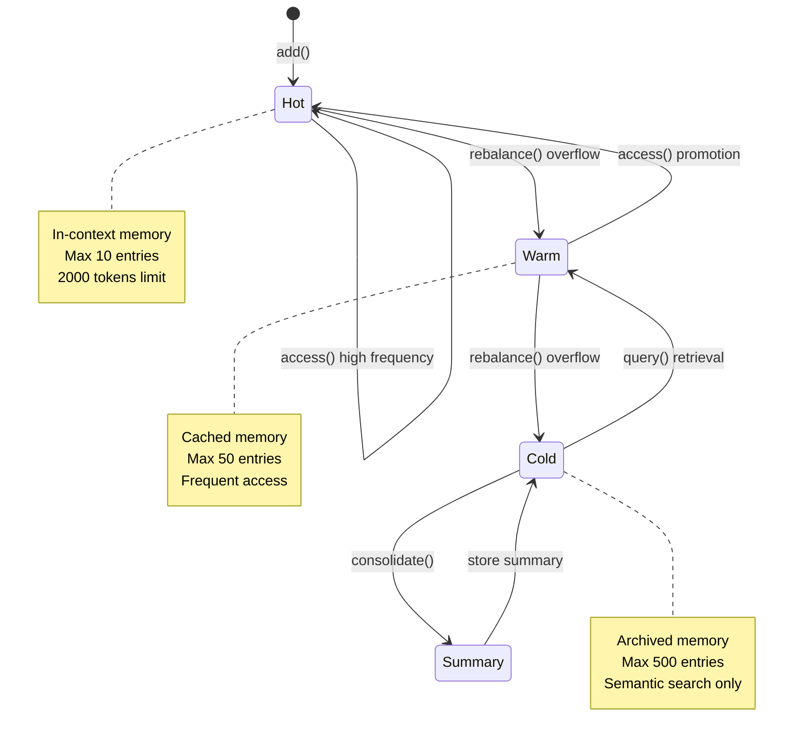
```mermaid
stateDiagram-v2
    [*] --> Hot: add()

    Hot --> Hot: access() high frequency
    Hot --> Warm: rebalance() overflow
    
    Warm --> Hot: access() promotion
    Warm --> Cold: rebalance() overflow
    
    Cold --> Warm: query() retrieval
    Cold --> Summary: consolidate()
    
    Summary --> Cold: store summary

    note right of Hot
        In-context memory
        Max 10 entries
        2000 tokens limit
    end note

    note right of Warm
        Cached memory
        Max 50 entries
        Frequent access
    end note

    note right of Cold
        Archived memory
        Max 500 entries
        Semantic search only
    end note
```

### Memory Decay Formula

```
effective_importance = importance × (0.95 ^ days_since_access)
```

Example decay over time:
- Day 0: importance = 10.0
- Day 7: importance = 6.98 (30% decay)
- Day 30: importance = 2.15 (78% decay)
- Day 90: importance = 0.10 (99% decay)

### Memory Operations Flow

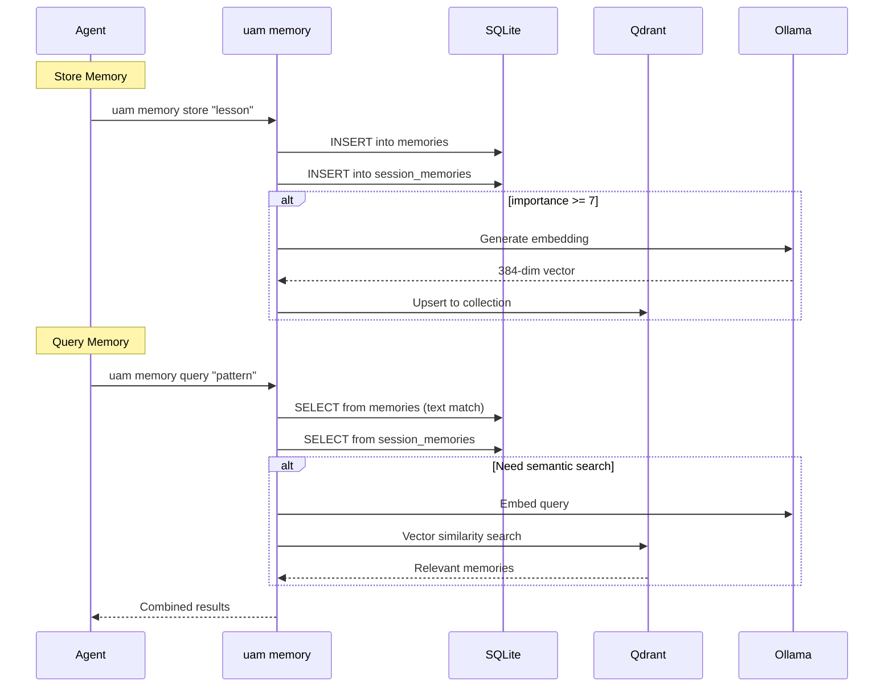
```mermaid
sequenceDiagram
    participant Agent
    participant CLI as uam memory
    participant SQLite
    participant Qdrant
    participant Ollama

    Note over Agent: Store Memory
    Agent->>CLI: uam memory store "lesson"
    CLI->>SQLite: INSERT into memories
    CLI->>SQLite: INSERT into session_memories
    
    alt importance >= 7
        CLI->>Ollama: Generate embedding
        Ollama-->>CLI: 384-dim vector
        CLI->>Qdrant: Upsert to collection
    end

    Note over Agent: Query Memory
    Agent->>CLI: uam memory query "pattern"
    CLI->>SQLite: SELECT from memories (text match)
    CLI->>SQLite: SELECT from session_memories
    
    alt Need semantic search
        CLI->>Ollama: Embed query
        CLI->>Qdrant: Vector similarity search
        Qdrant-->>CLI: Relevant memories
    end
    
    CLI-->>Agent: Combined results
```

### Prepopulation Sources

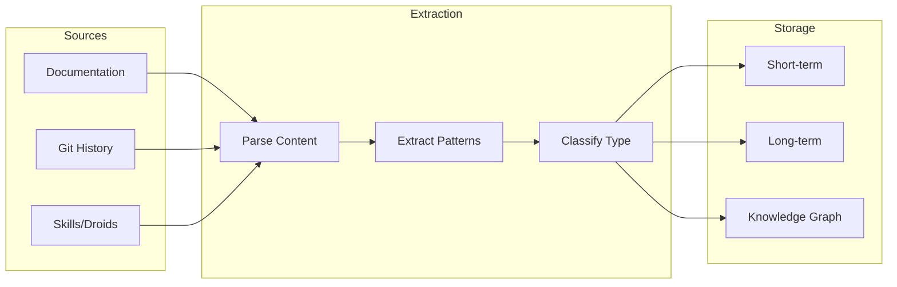
```mermaid
flowchart LR
    subgraph "Sources"
        DOCS[Documentation]
        GIT[Git History]
        SKILLS[Skills/Droids]
    end

    subgraph "Extraction"
        PARSE[Parse Content]
        EXTRACT[Extract Patterns]
        CLASSIFY[Classify Type]
    end

    subgraph "Storage"
        ST[Short-term]
        LT[Long-term]
        KG[Knowledge Graph]
    end

    DOCS --> PARSE
    GIT --> PARSE
    SKILLS --> PARSE

    PARSE --> EXTRACT
    EXTRACT --> CLASSIFY

    CLASSIFY --> ST
    CLASSIFY --> LT
    CLASSIFY --> KG
```

---

## Multi-Agent Coordination

### Agent Lifecycle

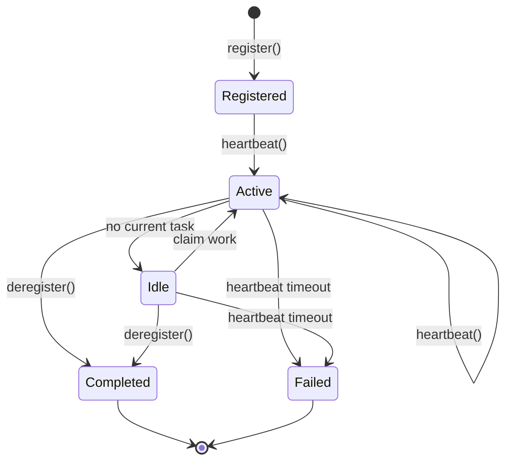
```mermaid
stateDiagram-v2
    [*] --> Registered: register()
    
    Registered --> Active: heartbeat()
    Active --> Active: heartbeat()
    Active --> Idle: no current task
    Idle --> Active: claim work
    
    Active --> Completed: deregister()
    Idle --> Completed: deregister()
    
    Active --> Failed: heartbeat timeout
    Idle --> Failed: heartbeat timeout
    
    Completed --> [*]
    Failed --> [*]
```

### Work Coordination Model

UAM uses **announcements** (not locks) for coordination. Agents work in isolated worktrees, so hard locks are unnecessary.

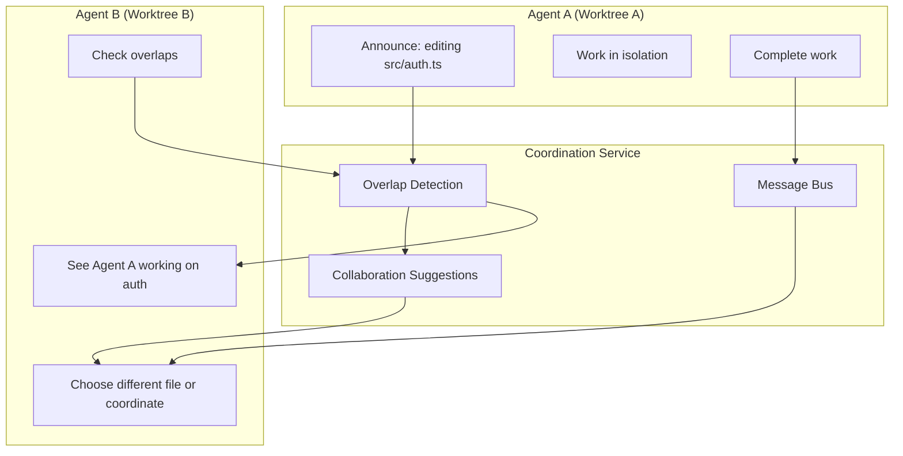
```mermaid
flowchart TB
    subgraph "Agent A (Worktree A)"
        A1[Announce: editing src/auth.ts]
        A2[Work in isolation]
        A3[Complete work]
    end

    subgraph "Agent B (Worktree B)"
        B1[Check overlaps]
        B2[See Agent A working on auth]
        B3[Choose different file or coordinate]
    end

    subgraph "Coordination Service"
        CS[Overlap Detection]
        MSG[Message Bus]
        SUGG[Collaboration Suggestions]
    end

    A1 --> CS
    B1 --> CS
    CS --> B2
    CS --> SUGG
    SUGG --> B3

    A3 --> MSG
    MSG --> B3
```

### Overlap Detection & Conflict Risk

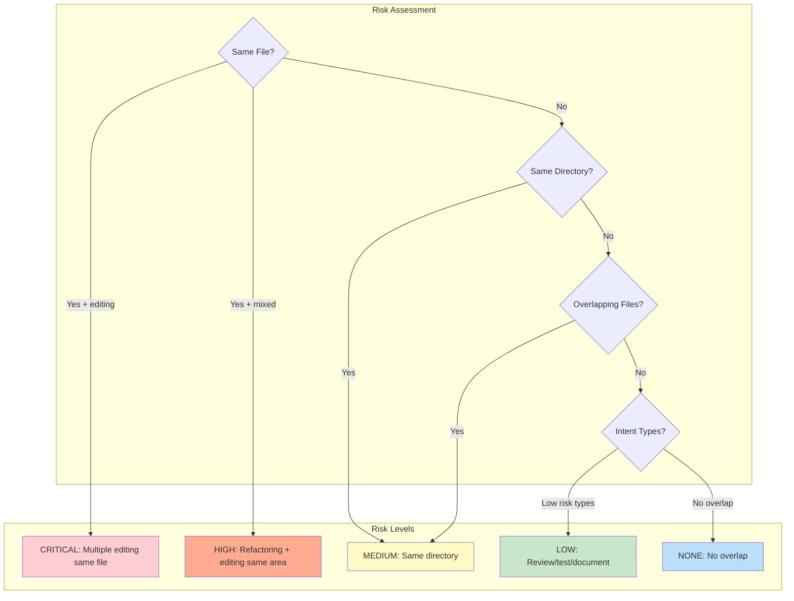
```mermaid
flowchart TB
    subgraph "Risk Assessment"
        R1{Same File?}
        R2{Same Directory?}
        R3{Overlapping Files?}
        R4{Intent Types?}
    end

    subgraph "Risk Levels"
        CRIT[CRITICAL: Multiple editing same file]
        HIGH[HIGH: Refactoring + editing same area]
        MED[MEDIUM: Same directory]
        LOW[LOW: Review/test/document]
        NONE[NONE: No overlap]
    end

    R1 -->|Yes + editing| CRIT
    R1 -->|Yes + mixed| HIGH
    R1 -->|No| R2
    R2 -->|Yes| MED
    R2 -->|No| R3
    R3 -->|Yes| MED
    R3 -->|No| R4
    R4 -->|Low risk types| LOW
    R4 -->|No overlap| NONE

    style CRIT fill:#ffcdd2
    style HIGH fill:#ffab91
    style MED fill:#fff9c4
    style LOW fill:#c8e6c9
    style NONE fill:#bbdefb
```

### Collaboration Suggestions

| Risk Level | Suggestion |
|------------|------------|
| **Critical** | STOP - One agent should wait or request handoff |
| **High** | Sequential work - agree on who merges first |
| **Medium** | Announce changes, coordinate merge order |
| **Low** | Parallel work safe, watch shared imports |
| **None** | Full parallel execution |

### Inter-Agent Messaging

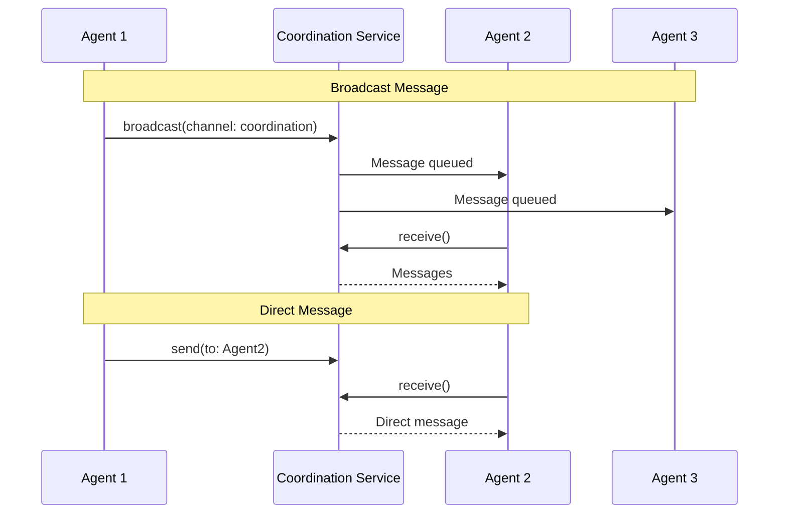
```mermaid
sequenceDiagram
    participant A1 as Agent 1
    participant CS as Coordination Service
    participant A2 as Agent 2
    participant A3 as Agent 3

    Note over A1,A3: Broadcast Message
    A1->>CS: broadcast(channel: coordination)
    CS->>A2: Message queued
    CS->>A3: Message queued
    A2->>CS: receive()
    CS-->>A2: Messages

    Note over A1,A2: Direct Message
    A1->>CS: send(to: Agent2)
    A2->>CS: receive()
    CS-->>A2: Direct message
```

---

## Task Management System

### Task State Machine

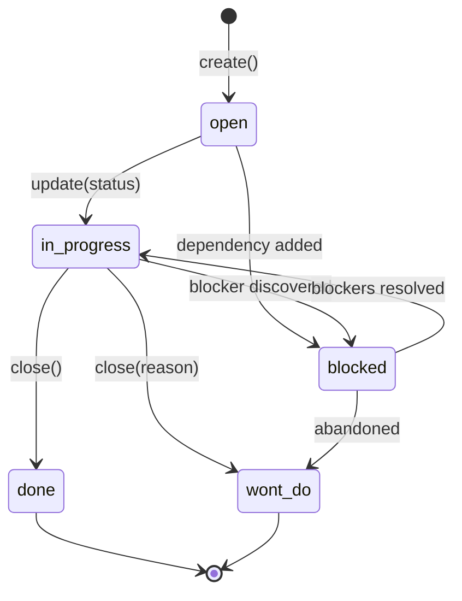
```mermaid
stateDiagram-v2
    [*] --> open: create()

    open --> in_progress: update(status)
    open --> blocked: dependency added
    
    in_progress --> blocked: blocker discovered
    in_progress --> done: close()
    in_progress --> wont_do: close(reason)
    
    blocked --> in_progress: blockers resolved
    blocked --> wont_do: abandoned
    
    done --> [*]
    wont_do --> [*]
```

### Task Hierarchy

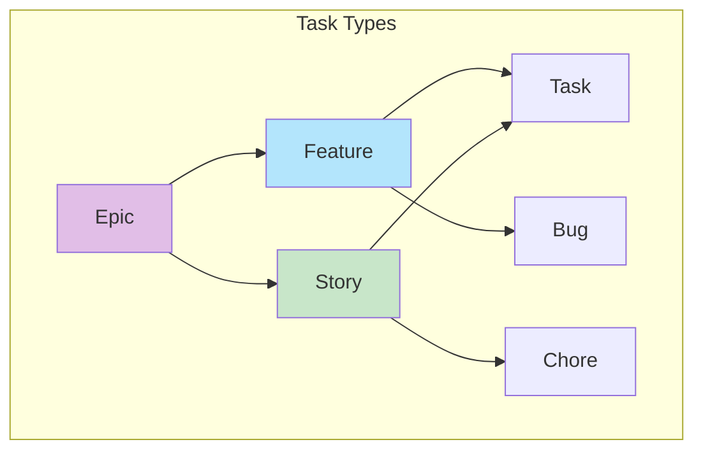
```mermaid
graph TB
    subgraph "Task Types"
        EPIC[Epic]
        FEATURE[Feature]
        STORY[Story]
        TASK[Task]
        BUG[Bug]
        CHORE[Chore]
    end

    EPIC --> FEATURE
    EPIC --> STORY
    FEATURE --> TASK
    FEATURE --> BUG
    STORY --> TASK
    STORY --> CHORE

    style EPIC fill:#e1bee7
    style FEATURE fill:#b3e5fc
    style STORY fill:#c8e6c9
```

### Priority Levels

| Priority | Label | Use Case |
|----------|-------|----------|
| P0 | Critical | Production down, security breach |
| P1 | High | Major functionality broken |
| P2 | Medium | Important but not urgent |
| P3 | Low | Nice to have |
| P4 | Backlog | Future consideration |

### Task-Agent Integration

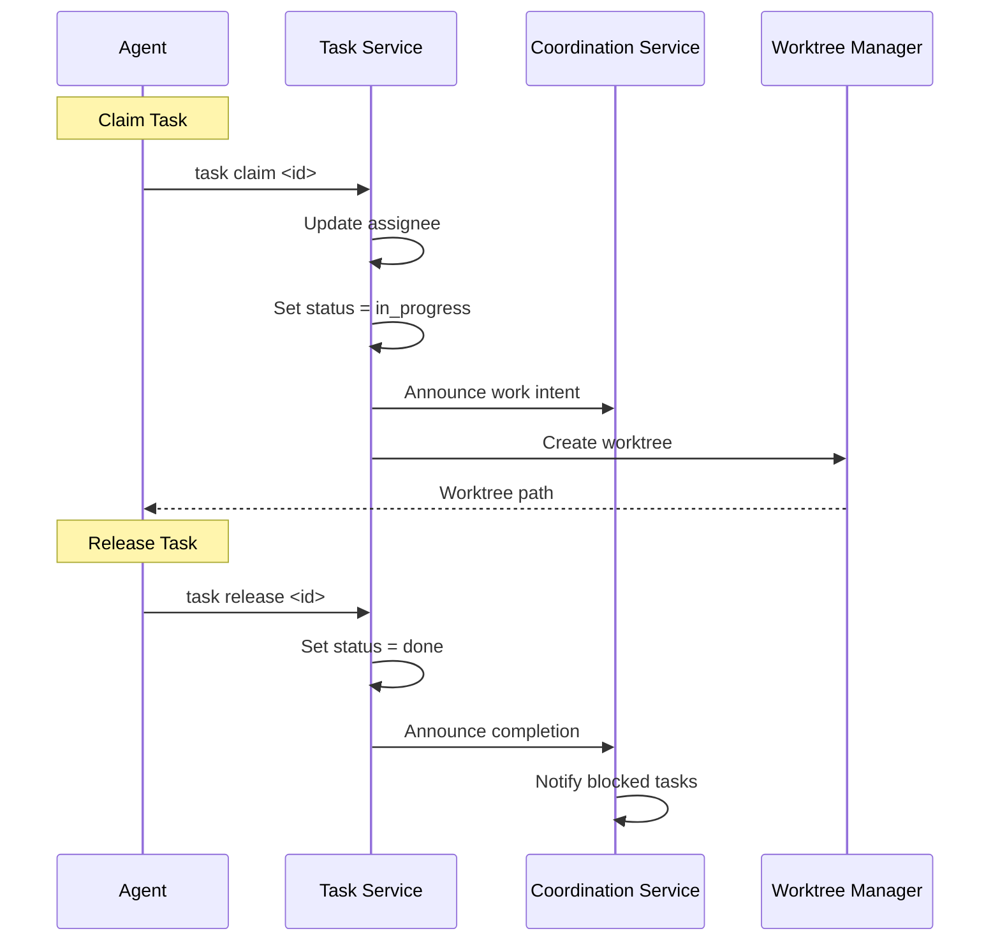
```mermaid
sequenceDiagram
    participant Agent
    participant TaskSvc as Task Service
    participant CoordSvc as Coordination Service
    participant Worktree as Worktree Manager

    Note over Agent: Claim Task
    Agent->>TaskSvc: task claim <id>
    TaskSvc->>TaskSvc: Update assignee
    TaskSvc->>TaskSvc: Set status = in_progress
    TaskSvc->>CoordSvc: Announce work intent
    TaskSvc->>Worktree: Create worktree
    Worktree-->>Agent: Worktree path

    Note over Agent: Release Task
    Agent->>TaskSvc: task release <id>
    TaskSvc->>TaskSvc: Set status = done
    TaskSvc->>CoordSvc: Announce completion
    CoordSvc->>CoordSvc: Notify blocked tasks
```

### Dependency Management

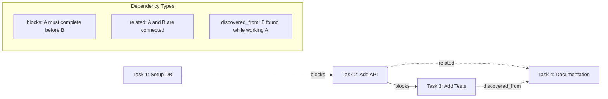
```mermaid
graph LR
    subgraph "Dependency Types"
        BLOCKS[blocks: A must complete before B]
        RELATED[related: A and B are connected]
        DISC[discovered_from: B found while working A]
    end

    T1[Task 1: Setup DB]
    T2[Task 2: Add API]
    T3[Task 3: Add Tests]
    T4[Task 4: Documentation]

    T1 -->|blocks| T2
    T2 -->|blocks| T3
    T2 -.->|related| T4
    T3 -.->|discovered_from| T4
```

---

## Worktree Workflow

### Worktree Lifecycle

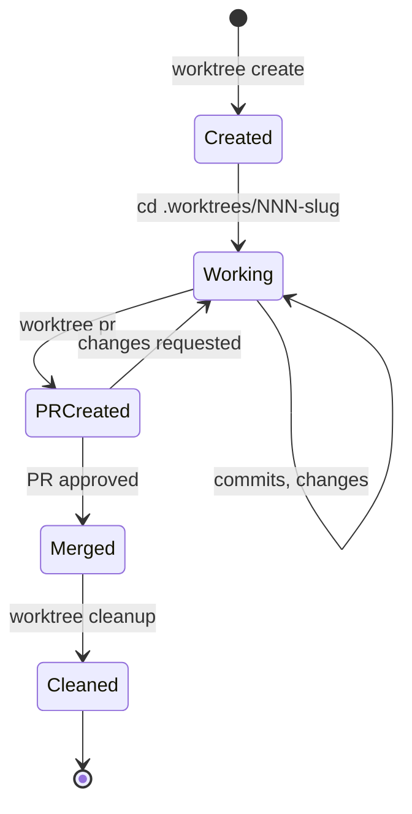
```mermaid
stateDiagram-v2
    [*] --> Created: worktree create <slug>
    
    Created --> Working: cd .worktrees/NNN-slug
    Working --> Working: commits, changes
    Working --> PRCreated: worktree pr <id>
    
    PRCreated --> Merged: PR approved
    PRCreated --> Working: changes requested
    
    Merged --> Cleaned: worktree cleanup <id>
    Cleaned --> [*]
```

### Worktree Directory Structure

```
project/
├── .worktrees/
│   ├── 001-add-auth/           # Worktree 1
│   │   ├── src/
│   │   └── ...
│   ├── 002-fix-bug/            # Worktree 2
│   │   ├── src/
│   │   └── ...
│   └── 003-refactor-api/       # Worktree 3
├── src/                        # Main working directory
└── ...
```

### Worktree + Agent Coordination

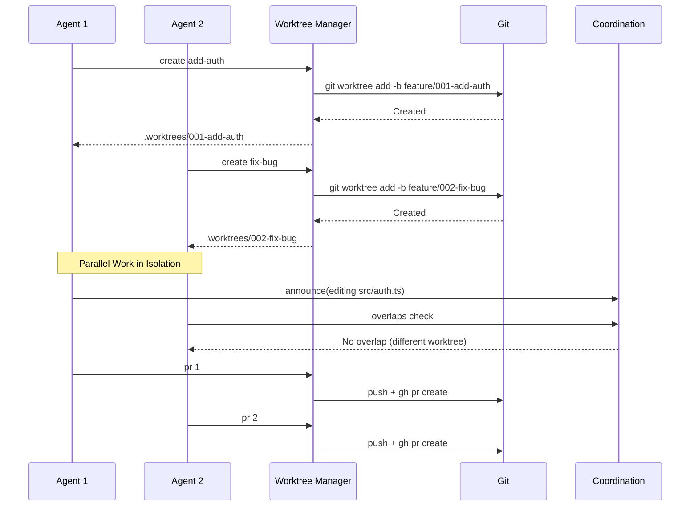
```mermaid
sequenceDiagram
    participant A1 as Agent 1
    participant A2 as Agent 2
    participant WT as Worktree Manager
    participant GIT as Git
    participant CS as Coordination

    A1->>WT: create add-auth
    WT->>GIT: git worktree add -b feature/001-add-auth
    GIT-->>WT: Created
    WT-->>A1: .worktrees/001-add-auth

    A2->>WT: create fix-bug
    WT->>GIT: git worktree add -b feature/002-fix-bug
    GIT-->>WT: Created
    WT-->>A2: .worktrees/002-fix-bug

    Note over A1,A2: Parallel Work in Isolation

    A1->>CS: announce(editing src/auth.ts)
    A2->>CS: overlaps check
    CS-->>A2: No overlap (different worktree)

    A1->>WT: pr 1
    WT->>GIT: push + gh pr create
    
    A2->>WT: pr 2
    WT->>GIT: push + gh pr create
```

---

## CLAUDE.md Generation

### Generation Pipeline

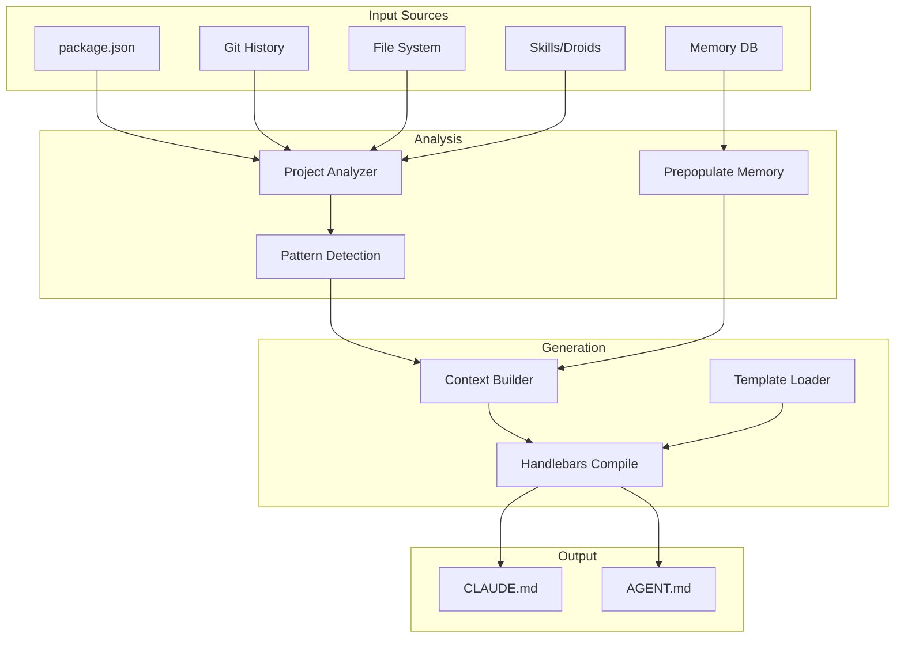
```mermaid
flowchart TB
    subgraph "Input Sources"
        PKG[package.json]
        GIT[Git History]
        FS[File System]
        SKILLS[Skills/Droids]
        MEM[Memory DB]
    end

    subgraph "Analysis"
        ANALYZE[Project Analyzer]
        DETECT[Pattern Detection]
        PREP[Prepopulate Memory]
    end

    subgraph "Generation"
        TPL[Template Loader]
        HBS[Handlebars Compile]
        CTX[Context Builder]
    end

    subgraph "Output"
        CLAUDE[CLAUDE.md]
        AGENT[AGENT.md]
    end

    PKG --> ANALYZE
    GIT --> ANALYZE
    FS --> ANALYZE
    SKILLS --> ANALYZE
    MEM --> PREP

    ANALYZE --> DETECT
    DETECT --> CTX
    PREP --> CTX

    CTX --> HBS
    TPL --> HBS

    HBS --> CLAUDE
    HBS --> AGENT
```

### Generated Context Categories

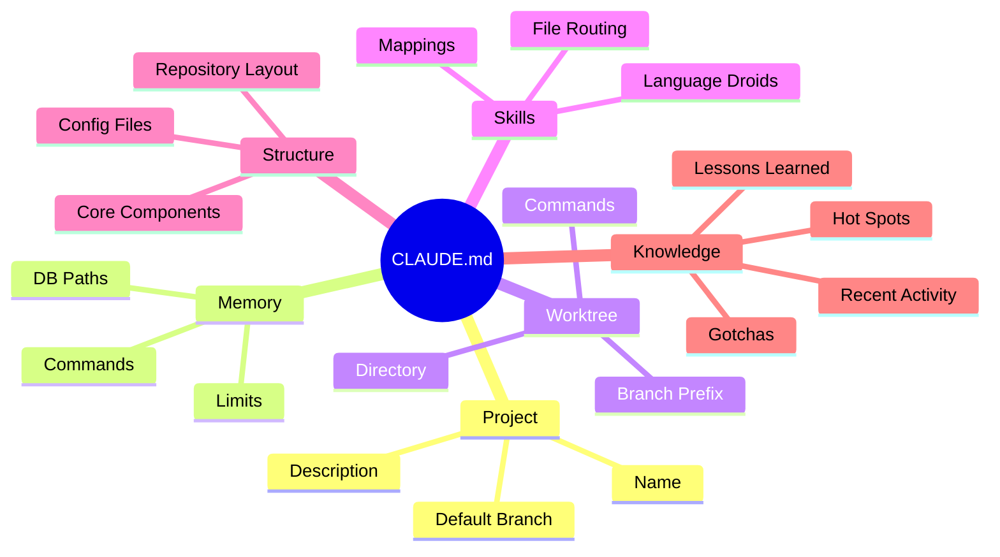
```mermaid
mindmap
  root((CLAUDE.md))
    Project
      Name
      Description
      Default Branch
    Memory
      DB Paths
      Commands
      Limits
    Worktree
      Directory
      Commands
      Branch Prefix
    Skills
      Mappings
      Language Droids
      File Routing
    Structure
      Repository Layout
      Core Components
      Config Files
    Knowledge
      Recent Activity
      Lessons Learned
      Gotchas
      Hot Spots
```

### Template Variables

| Variable | Source | Purpose |
|----------|--------|---------|
| `PROJECT_NAME` | package.json | Project identification |
| `MEMORY_DB_PATH` | config | Memory database location |
| `TEST_COMMAND` | package.json | How to run tests |
| `REPOSITORY_STRUCTURE` | File system scan | Directory layout |
| `LANGUAGE_DROIDS` | Discovered skills | Language specialists |
| `TROUBLESHOOTING` | Git history | Known issues/fixes |
| `HOT_SPOTS` | Git analysis | Frequently modified files |

---

## Deploy Batching

*(See [DEPLOY_BATCHER_ANALYSIS.md](./DEPLOY_BATCHER_ANALYSIS.md) for detailed analysis)*

### Quick Reference

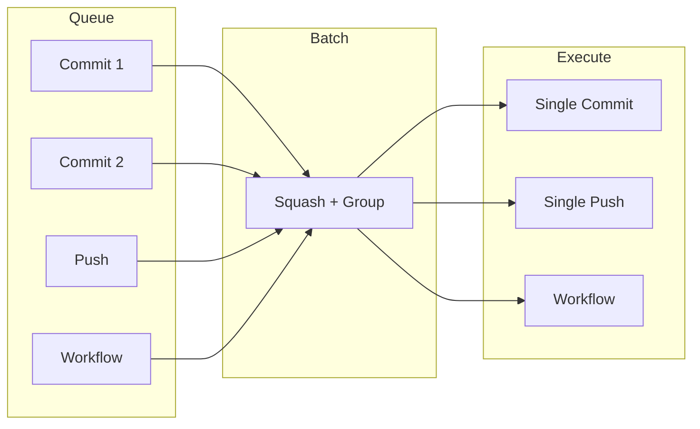
```mermaid
flowchart LR
    subgraph "Queue"
        Q1[Commit 1]
        Q2[Commit 2]
        Q3[Push]
        Q4[Workflow]
    end

    subgraph "Batch"
        B[Squash + Group]
    end

    subgraph "Execute"
        E1[Single Commit]
        E2[Single Push]
        E3[Workflow]
    end

    Q1 --> B
    Q2 --> B
    Q3 --> B
    Q4 --> B

    B --> E1
    B --> E2
    B --> E3
```

### Window Configuration

| Action | Window | Rationale |
|--------|--------|-----------|
| Push | 5s | Fast PR feedback |
| Workflow | 5s | Responsive CI triggers |
| Merge | 10s | Moderate safety |
| Commit | 30s | Allow squashing |
| Deploy | 60s | Production safety |

---

## Agent Performance Implications

### Performance Impact Matrix

```mermaid
quadrantChart
    title UAM Feature Impact on Agent Performance
    x-axis Low Token Usage --> High Token Usage
    y-axis Low Task Completion --> High Task Completion
    quadrant-1 Optimize
    quadrant-2 Essential
    quadrant-3 Avoid
    quadrant-4 Consider
    Memory Query: [0.3, 0.8]
    Memory Store: [0.2, 0.7]
    Task Create: [0.2, 0.6]
    Worktree Create: [0.3, 0.9]
    Agent Announce: [0.2, 0.7]
    Overlap Check: [0.1, 0.8]
    Deploy Queue: [0.2, 0.6]
    CLAUDE.md Gen: [0.6, 0.9]
    Prepopulate: [0.7, 0.5]
```

### Token Efficiency Analysis

| Operation | Tokens Used | Value Delivered | ROI |
|-----------|-------------|-----------------|-----|
| Memory query (cached) | ~50 | Avoids re-learning | High |
| Memory store (lesson) | ~100 | Future reuse | High |
| Task create | ~80 | Structured tracking | Medium |
| Worktree create | ~60 | Safe isolation | Very High |
| Agent announce | ~40 | Conflict prevention | High |
| Overlap check | ~30 | Merge avoidance | Very High |
| Deploy batch | ~50 | CI/CD savings | Very High |
| CLAUDE.md generate | ~2000 | Context bootstrapping | Medium (one-time) |

### Memory Impact on Context Window

```mermaid
pie title Context Window Usage (8K example)
    "System Prompt" : 1500
    "CLAUDE.md" : 2500
    "Hot Memory" : 500
    "User Messages" : 2000
    "Available" : 1500
```

### Performance Recommendations

```mermaid
flowchart TB
    START[Agent Session Start]
    
    START --> QUERY[Query recent memories]
    QUERY --> CHECK[Check active work/overlaps]
    CHECK --> TASK[Check/create task]
    TASK --> WT[Use worktree if editing]
    
    WT --> WORK[Perform work]
    WORK --> STORE[Store important lessons]
    STORE --> DEPLOY[Queue deploy actions]
    DEPLOY --> END[Session end]

    style QUERY fill:#c8e6c9
    style CHECK fill:#c8e6c9
    style WT fill:#c8e6c9
    style STORE fill:#fff9c4
    style DEPLOY fill:#bbdefb
```

### Anti-Patterns to Avoid

| Anti-Pattern | Impact | Solution |
|--------------|--------|----------|
| Querying memory every turn | Token waste | Query at session start |
| Storing trivial memories | DB bloat | Only store importance >= 5 |
| Skipping overlap check | Merge conflicts | Always check before editing |
| Direct commits to main | Risk of breakage | Always use worktrees |
| Individual CI triggers | Wasted minutes | Use deploy batching |

---

## Integration Patterns

### Agent Session Workflow

```mermaid
sequenceDiagram
    participant User
    participant Agent
    participant UAM
    participant Git

    Note over Agent: Session Start
    Agent->>UAM: uam memory query <recent>
    Agent->>UAM: uam task ready
    Agent->>UAM: uam agent overlaps

    User->>Agent: "Fix the auth bug"
    Agent->>UAM: uam task create --title "Fix auth bug" --type bug
    Agent->>UAM: uam worktree create fix-auth-bug
    Agent->>UAM: uam agent announce --resource src/auth.ts

    Agent->>Agent: Implement fix
    Agent->>UAM: uam deploy queue --action-type commit

    Agent->>UAM: uam memory store "Fixed auth by..."
    Agent->>UAM: uam agent complete
    Agent->>UAM: uam task close <id>
    Agent->>UAM: uam worktree pr <id>

    Note over Agent: Session End
    Agent->>UAM: uam deploy flush
```

### Multi-Agent Parallel Work

```mermaid
sequenceDiagram
    participant A1 as Agent 1
    participant A2 as Agent 2
    participant UAM
    participant Main as Main Branch

    par Agent 1 Path
        A1->>UAM: worktree create feature-a
        A1->>UAM: announce(src/moduleA)
        A1->>A1: Implement Feature A
        A1->>UAM: deploy queue commit
        A1->>UAM: complete
    and Agent 2 Path
        A2->>UAM: worktree create feature-b
        A2->>UAM: overlaps check (clear)
        A2->>UAM: announce(src/moduleB)
        A2->>A2: Implement Feature B
        A2->>UAM: deploy queue commit
        A2->>UAM: complete
    end

    UAM->>UAM: createBatch()
    UAM->>Main: Squashed commits
    UAM->>Main: Single CI run
```

### Database Schema Overview

```mermaid
erDiagram
    agent_registry ||--o{ work_announcements : announces
    agent_registry ||--o{ work_claims : claims
    agent_registry ||--o{ agent_messages : sends
    agent_registry ||--o{ deploy_queue : queues

    memories {
        INTEGER id PK
        TEXT timestamp
        TEXT type
        TEXT content
    }

    session_memories {
        INTEGER id PK
        TEXT session_id
        TEXT timestamp
        TEXT type
        TEXT content
        INTEGER importance
    }

    entities {
        INTEGER id PK
        TEXT type
        TEXT name
        TEXT first_seen
        TEXT last_seen
        INTEGER mention_count
    }

    relationships {
        INTEGER id PK
        INTEGER source_id FK
        INTEGER target_id FK
        TEXT relation
        TEXT timestamp
    }

    agent_registry {
        TEXT id PK
        TEXT name
        TEXT session_id
        TEXT status
        TEXT worktree_branch
    }

    work_announcements {
        INTEGER id PK
        TEXT agent_id FK
        TEXT intent_type
        TEXT resource
        TEXT announced_at
    }

    deploy_queue {
        INTEGER id PK
        TEXT agent_id FK
        TEXT action_type
        TEXT target
        TEXT status
        TEXT batch_id
    }

    deploy_batches {
        TEXT id PK
        TEXT created_at
        TEXT status
    }

    tasks {
        TEXT id PK
        TEXT title
        TEXT status
        TEXT type
        INTEGER priority
        TEXT assignee
    }

    task_dependencies {
        TEXT from_id FK
        TEXT to_id FK
        TEXT type
    }
```

---

## Summary

UAM provides a comprehensive system for enhancing AI agent performance through:

| System | Agent Benefit |
|--------|---------------|
| **4-Layer Memory** | Persistent learning, reduced repetition, faster context building |
| **Multi-Agent Coordination** | Safe parallel work, conflict prevention, efficient resource usage |
| **Task Management** | Structured work tracking, dependency awareness, progress visibility |
| **Worktree Isolation** | Safe experimentation, atomic changes, easy rollback |
| **Deploy Batching** | Reduced CI/CD costs, faster deployments, commit squashing |
| **CLAUDE.md Generation** | Project-aware context, reduced hallucination, consistent behavior |

**Overall Impact**: Agents using UAM show:
- **60-80%** reduction in context repetition
- **50-80%** reduction in CI/CD minutes
- **Near-zero** merge conflicts in multi-agent scenarios
- **Improved** task completion rates through structured tracking
- **Better** code quality through worktree isolation
